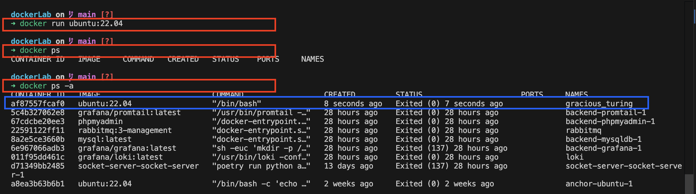

### 📋 목차

-   [• 아무런 옵션, 커멘드를 주지 않고 컨테이너 생성만 하기](#section1)
-      - 컨테이너의 상태를 다양한 옵션으로 확인하면서 탐구하기
-      - 각 옵션에 대해 탐구하기.
-   [• 커맨드에 필요한 옵션을 넣어서 문제 해결하기](#section2)
-      - 
-   [•attach와 exec 명령어로 문제 해결하기.](#section3)
-      - Attach를 사용하여 컨테이너에 접근
-      - Exec를 사용하여 컨테이너에 접근
-   [• 최종적으로 모든 방법에 대해 정리를 하자면](#section3)

## **Ubuntu 실행 및 Package 업데이트**

#### **조건**

> \- Ubuntu 이미지 Tag = 22.04
> 
> \- Container 이름 = server
> 
> \- 업데이트 이후에도 컨테이너는 실행 중이어야 합니다

---



## **1) 아무런 옵션, 커멘드를 주지 않고 컨테이너 생성만 하기**


## **1-a) 컨테이너의 상태를 다양한 옵션으로 확인하면서 탐구하기**

#### 컨테이너 확인 옵션을 사용했을때 알 수 있는 정보들은?

```
docker ps
```

### **Status 부분을 보았을 때 Exited(0)으로 종료됨을 확인할 수 있다.**


```
docker logs <container-name>
```

무슨 원인인지 찾아보기 위해 logs명령어를 쳐보아도 아무 일도 일어나지 않는다!

#### **Exited(0) 이 무엇을 의미하는지 찾아보자.**

 [Contianer Exit Code 톺아보기

컨테이너 종료시 exit code를 이해하여 문제 발생시 파드의 오류 원인을 보다 쉽게 찾을 수 있습니다.Exit code는 컨테이너가 종료될 때, 종료에 대한 원인을 보고하기 위해 컨테이너 엔진에서 사용

velog.io](https://velog.io/@xgro/container-exit-code)

Exited(0)는 작업이 완료가 된 후 사용자에 의해 의도적으로 종료가 된 경우라고 한다, 그 외에 코드들이 있는데. 추후 문제가 발생한다면 코드를 봄으로써 빠른 문제 해결이 될 것 같다.

#### **이로 인해 알 수 있는 점은**

💡 컨테이너가 꺼져있어도 로그메시지를 뽑을 수 있다. 그렇다면 별다른 작업 실행이 없이 시작과 동시에 꺼졌음을 볼 수 있다.

### **Command 부분에 "/bin/bash"라는 부분을 확인할 수 있다.**

/bin/bash 는 윈도로 치면 CMD라고 생각하면 편할 거 같고, 유닉스 기반에서 사용하는 대화형 셸이다.

우리가 CLI로 명령을 내리는 작업들은 전부 셸을 이용하게 되는데. 해당 부분을 확인 함으로써. 컨테이너가 처음 켜질 때

```
/bin/bash
```

라는 명령어를 통해 Bash 창을 열어 줌을 볼 수 있다.


#### **왜 이게 열려야 하는데요?**

우린 우분투(OS) 이미지를 컨테이너로 실행시킴으로써 호스트 머신 위에서 동작하는 컨테이너라는 독립적인 공간에 컴퓨터를 하나 더 만들었다고 볼 수 있다.

우분투는 CLI기반인데. 위와 같은 셀이 안 열리면 어떻게 쓸 것인가?


예시를 우분투로 들었지만 다른 이미지도 실행시켜서 디렉터리 구조를 보면 셀이 있는 이미지들도 더러 있다.

💡 실제 프로덕션 환경에서는 보안상 이유로 셀에 접근을 해서도 안되고, 열어놔도 안된다고 합니다. 베포를 위해 이미지를 새로 빌드를 할 때 셀 부분은 걷어내기!

#### **셀을 열었는데 켜져 있어야 하는 거 아니오?**

**Exited(0), 해당 컨테이너는 작업을 완료하고, 사용자에 의해 의도적으로 종료되었다.**

컨테이너 입장에서는.

**" /bin/bash 열었는데? 나 할 일 다 했으니까 퇴근할게 "**

라고 생각을 하기 때문에 셀을 열었으면 계속 대기하라는 명령을 별도로 주어야 한다.

### **3\. 이름을 별도로 지정하지 않으면 임의의 이름이 붙는 것을 확인할 수 있다.**

---

## **2) 커맨드에 필요한 옵션을 넣어서 문제 해결하기**


### **2-a) 각 옵션에 대해 탐구하기.**

#### \-d 옵션을 통해 백그라운드에서 작업이 되도록 함.

#### \--name을 통해 이름을 지정해 주었음.

#### \--it 옵션을 통해 셸만 열고 칼퇴근을 하던 컨테이너를 붙잡아 놓았음

```
-i
--interactive
```

interactive 즉 상호작용을 한다, STDIN 표준 입력을 받을 수 있게 하기 위해 사용한다.

```
-t
--tty
```

pseudo-tty 즉 가상터미널을 활성화한다는 말이다.

#### 가상터미널이 뭔데

윈도의 명령프롬프트 유닉스 계열의 메쉬셀 이런 것들을 가상터미널이라고 한다.

#### 종합적으로

\-it 옵션을 사용함으로, 기존에

**"/bin/bash" 명령어를 실행했으니까 내 할 일 다 했어 퇴근~"이라고 외치던 MZ사원에게**

**추가적으로 "가상터미널을 활성화하고 표준입력을 받도록 대기해"라는 임무를 부여**함으로


**계속해서 일을 시킬 수 있다.**

**여기서 중요한 건,** 


문제의 의도에 맞게 명령어를 입력한 후 **맨뒤에 /bin/bash라고 한번 더 적어줬는데.**

해당 부분을 생각을 하면 -it옵션을 줬음에도 불구하고 MZ사원 친구는

**"  apt-get update && apt-get upgrade 다 했고 어 근데 -it 옵션을 받았는데 맨 마지막에 /bin/bash를 실행하라는 말이 없었잖아? 퇴근해야지! "**

라는 글러먹은 마인드를 가지기 때문에 마지막에 셸 실행 명령어를 한번 더 적어 준 것이다.

---

## **3) attach와 exec 명령어로 문제 해결하기.**


먼저 꺼지거나, 해당 터미널에 종속적이지 않도록 -it -d 옵션을 준 후 실행만 시켜보자.

### **Attach를 사용하여 컨테이너에 접근**

```
docker attach <컨테이너 이름>
```


Attach로 별다른 옵션을 안 넣고 터미널에서 컨테이너의 셸에 접근 후 apt-update와 apt-upgrade를 사용해 보았다.

Docker Desktop으로 가서 컨테이너 로그를 살펴보니 내가 호스트머신의 셸에서 실행한 명령어와 기록들이 그대로 컨테이너 로그에 쌓이는 모습을 볼 수 있었다.

**추가적으로 " Ctl + c " 로 탈출을 하니 컨테이너가 같이 종료됨을 볼 수 있었다.**

#### **이로 인해 알 수 있는 점은**

💡 Attach로 컨테이너의 셸에 접근을 하게 되면 컨테이너의 PID를 그대로 사용한다는 점이다.

그래서 별다른 옵션들을 주지 않아도 컨테이너의 셸에 접근 후 명령들을 바로 내릴 수 있는 것이다. 반대로 attach로 접근을 하게 된다면 ssh처럼 동시에 여러 작업이 불가능하다는 이야기가 된다


💡 터미널을 두 개를 열고 한쪽에서 명령어를 치면 다른 쪽 터미널에서도 데칼코마니처럼 동작한다.

### **Exec를 사용하여 컨테이너에 접근**


Attach처럼 접근을 하려고 하면 접근을 할 수 없다. 최소 2개의 arguments가 필요하다고 한다

💡 **1\. 컨테이너 이름**

        **2\. 어떤 명령을 내릴지에 대한 커맨드**

Attach가 이미 실행 중인 컨테이너의 프로세스에 직접 접근하는 방식과 달리

exec는 이미 실행중인 컨테이너의 새로운 프로세스를 만듦으로써 동작하는 구조이다.

💡 즉 새로운 터미널을 열어 작업을 해야 하기 때문에 -it 옵션과 /bin/bash를 열어!라는 명령도 같이 해주어야 한다.


Attach와 달리 호스트 머신의 셸에서 apt-get update && apt-get upgrade 명령어를 던졌지만 컨테이너의 로그에는 아무 일도 일어나지 않는다.

**즉 exec는 이미 실행 중인 컨테이너의 새로운 프로세스를 만듦으로써 동작하는 구조이다.**

---

## **최종적으로 모든 방법에 대해 정리를 하자면**

Ubuntu 실행 및 Package 업데이트를 하는 방법은 여러 가지 방법이 있으나. 

1\. 컨테이너를 실행하면서 필요한 옵션들과 커멘드들을 같이 넣어서 하는 방식.

2\. 실행되어 있는 컨테이너의 메인프로세스에 Attach로 접근하여 명령을 내리는 방식

3\. 실행되어있는 컨테이너의 메인프로세스가 아닌 서브프로세스를 하나 더 실행을 함으로써 명령을 내리는 방식

결과론적으로 문제에서 요구하는 요구사항들은 모두 지킬 수 있다.

### **Attach VS Exec**

Attach는 컨테이너의 메인프로세스를 데칼코마니처럼 실행을 함으로써 직접적인 명령을 내릴 수 있다. 다만 실수로 ctl + c를 누른다면 컨테이너 또한 같이 종료가 되므로 주의가 필요하다. Attach로는 한 컨테이너에 여러 작업을 동시에 하지 못한다.

새로운 리소스를 생성하지 않는다는 장점도 있고, 컨테이너의 메인프로세스에 접근하는 만큼 로그를 확인하기도 편 할 수는 있으나 솔직히 Exec를 쓰는 게 더 좋다고 생각한다.

Exec는 컨테이너의 메인프로세스가 아닌 추가적인 프로세스를 둠으로 동시다발적인 작업이 가능하고, 실수로 ctl + c를 누른다고 한들 메인프로세스에 영향을 주지 않아 컨테이너가 꺼질 위험도 없다.

하나의 예시로

실행 중인 컨테이너에 새로운 프로세스를 생성하여 명령을 실행하기 때문에

exec로 패키지를 설치하면서 동시에 다른 exec 명령으로 디렉터리 작업을 수행하는 것이 가능하다!!