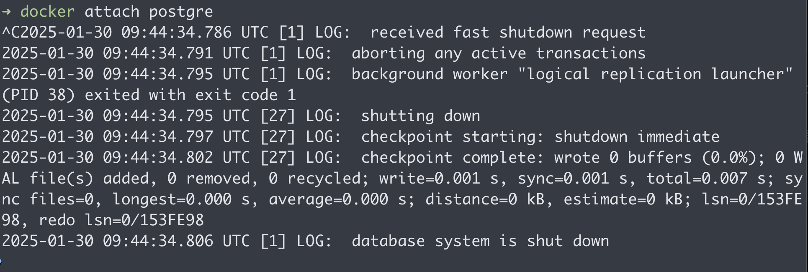

# PostgreSQL DB에 Table 생성하기
## 조건
- postgres:16.1-bullseye 이미지를 사용합니다.
- 컨테이너의 이름은 psql_db 로 설정합니다.
- Container 생성시 다음 환경변수가 설정되어야 합니다.
- POSTGRES_PASSWORD
1. PostgreSQL DB 컨테이너를 실행하세요
2. exec 를 사용하여 컨테이너 터미널에 접근하세요
3. 터미널에서 psql -U postgres 를 입력하여 PostgreSQL 에 접속하세요
4. 다음 Query 를 실행하세요


# 깨달음


## 해당 요구 사항을 보고 분석을 하자면 ?


### 왜 exec로 해, attach로 접속을 해본다면 ?


아무일도 일어나지 않는다

### 왜그럴까 ?

Attach는 컨테이너의 메인프로세스(PID 1)에 직접 연결을 하는것이고, exec는 컨테이너의 메인프로세스가 아닌 새로운 프로세스를 실행한다고 했다.

즉 postgre는 PID 1이 /bin/bash가 아니란 말이 될 것이다.



PID 1이 /bin/bash가 아니더라도 PID 1번이 무엇인지는 몰라도 메인프로세스인건 확실하다. 아무 생각없이 ctl+c 로 나오게 된다면 컨테이너가 꺼져버린다.

### 센터를 까보자


```
docker exec <컨테이너 이름> ps aux
```

해당 명령어를 처보면 여러 프로세스들이 나온다.

postgre 라는 이름을 가진 컨테이너가 내부적으로 여러 작업들, 즉 프로세스들로 이루어짐을 볼 수 있는데.

PID가 1인 프로세스는 /bin/bash가 아니다!

다시한번 우분투 이미지를 실행하고 ATTACH로 접속 후 명령어를 내릴 수 있던이유는 우분투의 경우에는 메인프로세스, PID 1이 /bin/bash 이기 때문이다
(윈도우로 치면 명령프롬프트, 맥에선 Iterm)


일전에 실행 한 우분투의 PID를 보니까

PID 1이 /bin/bash 이다.

### EXEC로 /bin/bash를 실행 후 작업을 실행할때 새로운 PID번호가 생길까 ?


## 정리

**docker exec**는 컨테이너 내부에서 쉘이나 다른 명령을 실행할 때 사용하는 방법으로, 컨테이너의 메인 프로세스와 독립적으로 동작한다.
**docker attach**는 컨테이너의 메인 프로세스에 직접 연결하는 방법이므로, PID 1이 bash가 아닐 경우 연결되지 않거나 제대로 동작하지 않을 수 있다.